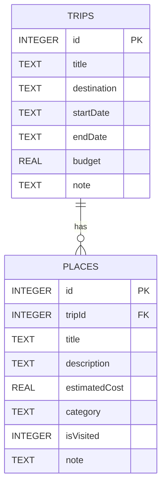

# Database Schema

Room database `travel_planner.db`, version 1.

## ER Diagram

## Tables

### `trips`
| Column | Type | Constraint |
|--------|------|-----------|
| id | INTEGER | PK AUTOINCREMENT |
| title | TEXT | NOT NULL |
| destination | TEXT | NOT NULL |
| startDate | TEXT | NOT NULL (YYYY-MM-DD) |
| endDate | TEXT | NOT NULL (YYYY-MM-DD) |
| budget | REAL | NOT NULL DEFAULT 0 |
| note | TEXT | NOT NULL DEFAULT '' |

### `places`
| Column | Type | Constraint |
|--------|------|-----------|
| id | INTEGER | PK AUTOINCREMENT |
| tripId | INTEGER | FK → trips(id) CASCADE |
| title | TEXT | NOT NULL |
| description | TEXT | NOT NULL |
| estimatedCost | REAL | NOT NULL DEFAULT 0 |
| category | TEXT | NOT NULL (PlaceCategory.name) |
| isVisited | INTEGER | NOT NULL (0/1) |
| note | TEXT | NOT NULL |

Full SQL: [schema.sql](../schema.sql)
