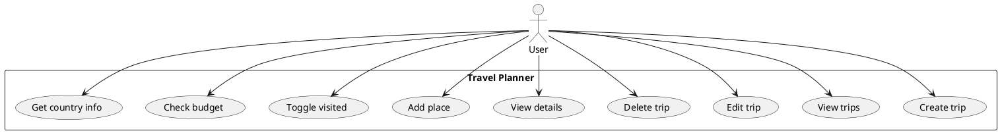

# Functional Requirements

| ID | Requirement |
|----|-------------|
| FR-01 | User can create a trip with title, destination, dates, budget |
| FR-02 | User can view the list of all trips |
| FR-03 | User can edit an existing trip |
| FR-04 | User can delete a trip (places deleted by cascade) |
| FR-05 | User can view trip details with places |
| FR-06 | User can add a place to a trip |
| FR-07 | User can toggle a place as visited |
| FR-08 | User can set estimated cost per place |
| FR-09 | App calculates total spent and budget remaining |
| FR-10 | App fetches country info via REST Countries API |

## Use Case Diagram (PlantUML)

